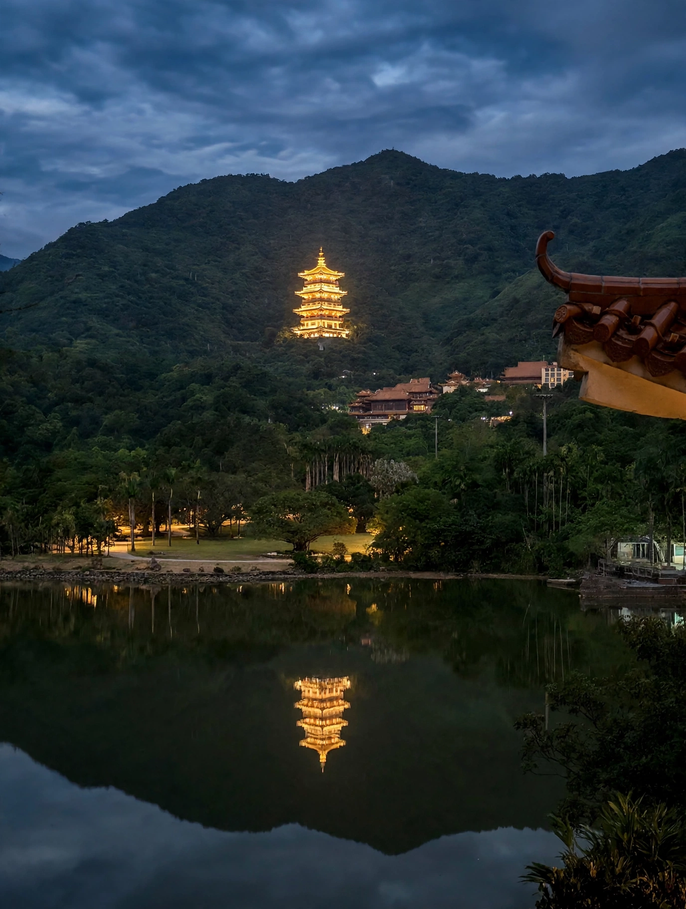
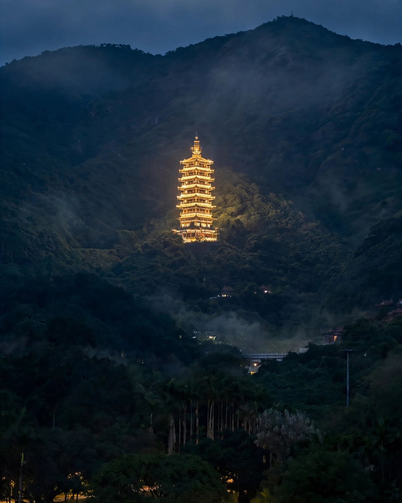
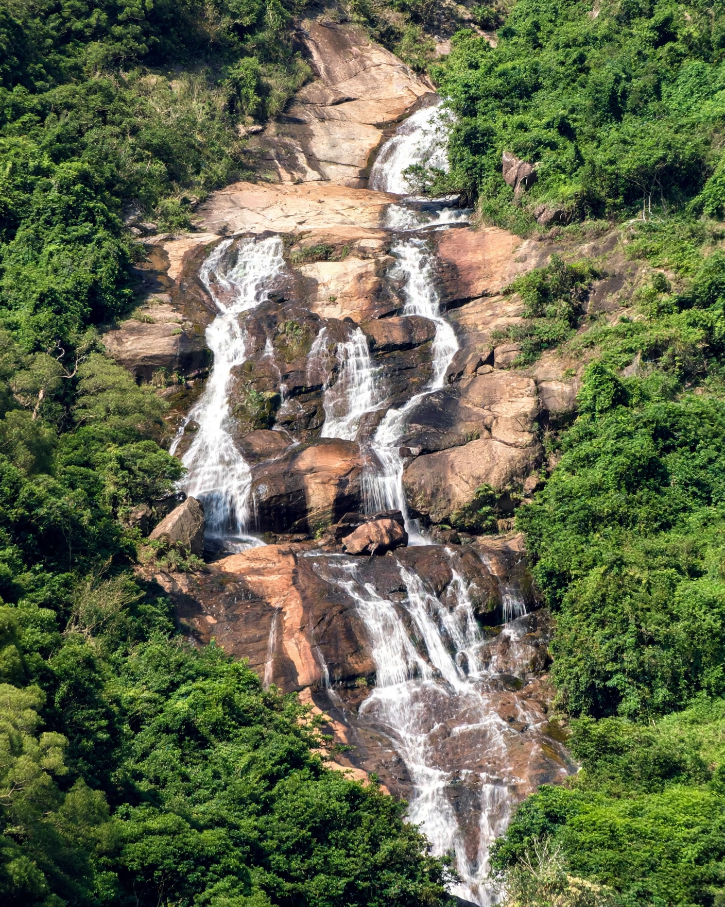

# Examples / 示例

Before/after pairs produced with these skills. Each `before.webp` is the original, each `after.webp` is the skill output (retouch + upscale to 2K where needed).

注：这组示例的原图为 AI 生成的底图；修图流程本身同样适用于实拍照片。

## vcg-retouch（视觉中国修图）

### 1. tower-night-wide（宝塔夜景·全景）
| before | after |
|---|---|
|  |  |

诊断：夜景暗部偏闷、主体宝塔不够突出、整体偏软。处理：暗部提亮找回层次（保留夜感，不修成白天）、主体局部锐化、影调统一偏蓝调时刻氛围、Real-ESRGAN 放大到 2K。

### 2. tower-night-telephoto（宝塔夜景·长焦特写）
| before | after |
|---|---|
|  |  |

诊断：长焦压缩感已有，但暗部死黑、宝塔灯光溢出偏糊。处理：暗部细节找回、灯光高光压制不死白、主体锐化、去雾化影调、Real-ESRGAN 放大到 2K。对应 skill 中的"长焦特写版"构图模板：主体占满画面，强调压缩感与质感。

### 3. waterfall-telephoto（瀑布·长焦特写）
| before | after |
|---|---|
|  |  |

诊断：原图偏平、对比不足、水流高光偏灰。处理：对比度与饱和度适度提升（鲜艳不荧光）、水流高光找回层次、岩石与植被局部锐化、放大到 2K。
