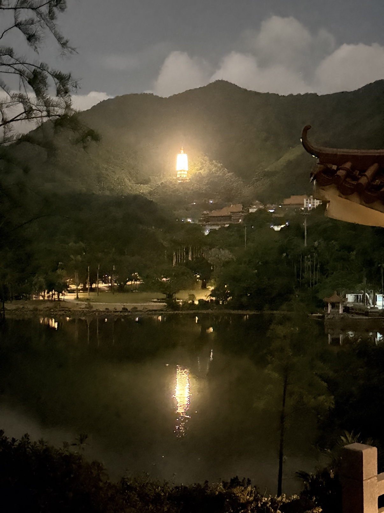
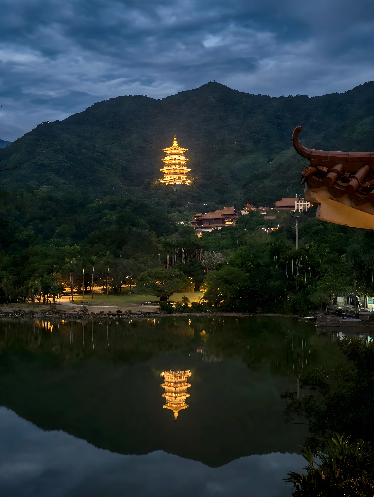
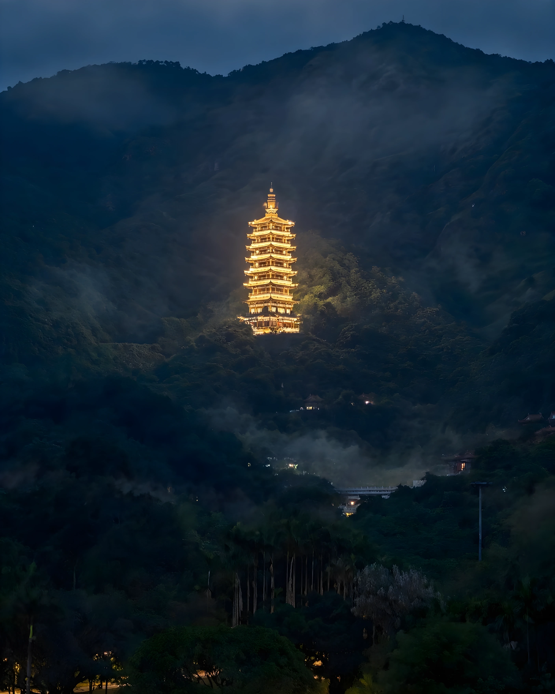
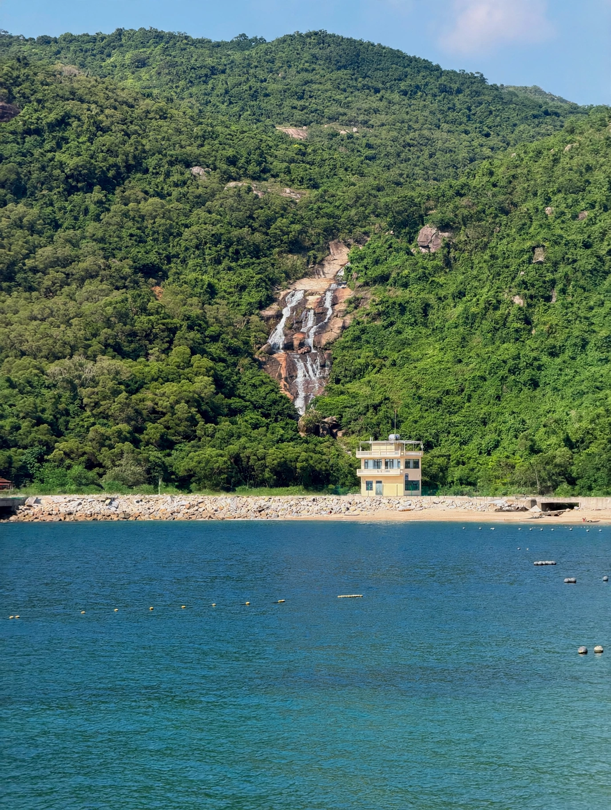
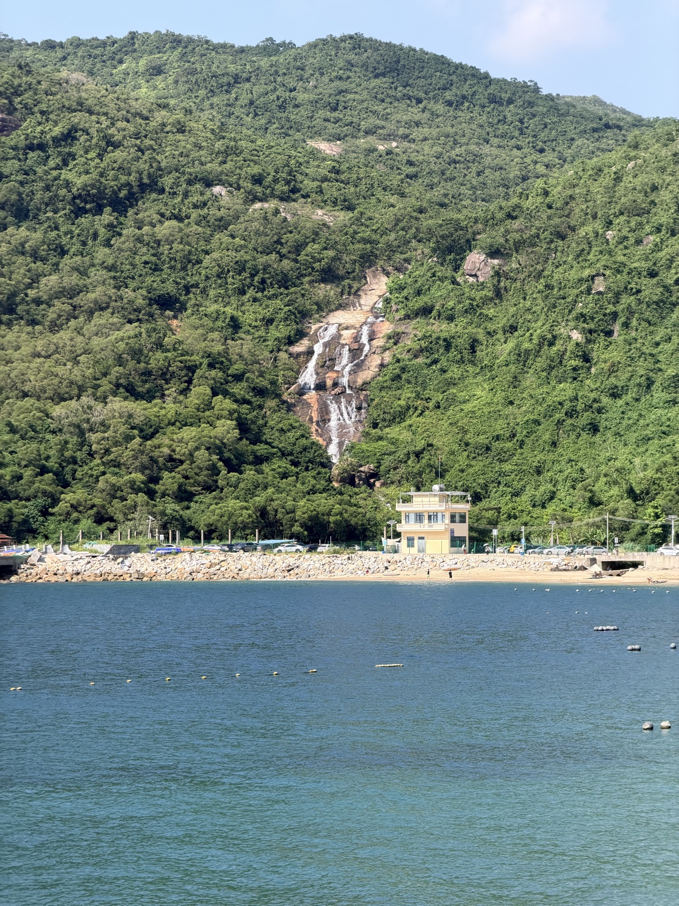

# Examples / 示例

Before/after pairs produced with these skills. Each `before` is the user's original photo, each `after` is the skill output (retouch + upscale to 2K where needed).

示例原图均为用户实拍照片；after 为 skill 输出成品（含 2K 放大）。

## vcg-retouch（视觉中国修图）

### 1. tower-night-wide（宝塔夜景·全景校正版）
| before | after |
|---|---|
|  |  |

诊断：手机夜景雾气重、宝塔过曝成光团、左上角树枝入镜、整体偏灰偏软。处理：去雾、宝塔高光压制找回灯盏层次、裁掉树枝、暗部提亮找回层次（保留夜感，不修成白天）、影调统一为蓝调时刻氛围、Real-ESRGAN 放大到 2K。

### 2. tower-night-telephoto（宝塔夜景·长焦特写版）
| before | after |
|---|---|
|  |  |

同一张原图的**二次构图**版本：向宝塔裁近，fill the frame，主体放三分点，强调长焦压缩感与质感；灯光高光压制、主体锐化、Real-ESRGAN 放大到 2K。

### 3. waterfall-wide（瀑布·全景修图版）
| before | after |
|---|---|
|  |  |

诊断：白天隔水远拍，瀑布在画面中太小，前景建筑、车辆、堤坝杂乱抢戏。处理：瀑布主体局部锐化提亮、前景杂乱元素做减法、饱和对比适度提升（鲜艳不荧光）、影调统一。

### 4. waterfall-telephoto（瀑布·长焦特写版）
| before | after |
|---|---|
|  |  |

同一张原图的**二次构图**版本：向瀑布大幅裁近，主体占满画面，裁掉前景水面与建筑，突出水流质感；水流高光找回层次、岩石植被锐化、放大到 2K。
